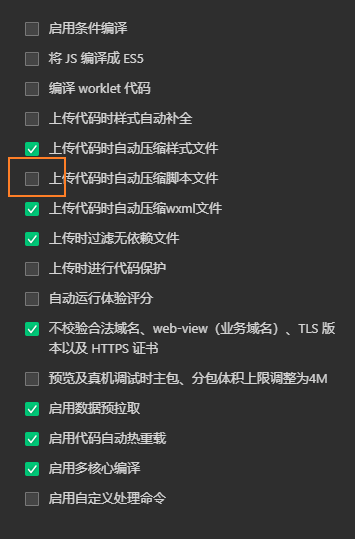

## 蓝牙概念
https://blog.csdn.net/DOF526570/article/details/128805265
https://www.jianshu.com/p/535e6ec3571d

### 两种类型
- 经典蓝牙， 蓝牙 4.0 协议一下的模块
- 低功耗蓝牙， 用 BLE 表示
蓝牙 4.0 协议中包含了 BLE
- BLE，是使用2.4GHz的无线短距离无线通信标准。
- 设备端和主机端使用GATT(Generic ATTribute) profile进行通信。 如果你听到GATT这个名词，就可以将其想成使用BLE，这没什么问题。

### GATT 概念
一个设备中存在很多的 "service", service 中包含多个 "characteristic"

- 蓝牙设备
一个蓝牙设备创建一个蓝牙服务器
比如鼠标，需要发送信息给外界
它就是一个蓝牙服务器
一个服务器可以建立多个服务
一个服务里有很多特征值，特征值可以有各种类型，可以读或些
这些值可以发送给客户端
客户端也可以写值更改特征值


- UUID
服务、特征值 都是根据 UUID 来进行识别的
既有 16 位也有 128 位， 16 位的 UUID 是经过蓝牙组织认证的

UUID 由蓝牙设备厂商提供，是硬件编程里确定了的
可以在网站生成 https://www.uuidgenerator.net/version4
想要操作特定的服务、特征值都需要通过UUID来找。
- notify 通知
服务器可以用 notify 的方式主动给客户端发信息
- 写入
客户端可以写入特征值
- 读
客户端可以读取特征值


## esp32 蓝牙
用微信小程序搜索 esp32 蓝牙
我用的小程序： 蓝牙调试开发工具
玩转 ESP32 + Arduino (九) ESP32 低功耗蓝牙BEL - 简书 (jianshu.com)

esp32C3 不支持经典蓝牙，只能用低功耗蓝牙


* esp32 实现蓝牙通讯
```
创建BLE设备 BLEDevice::init(ble_name);
创建BLE服务器 BLEServer *pServer = BLEDevice::createServer();
创建若干服务 BLEService *pService = pServer->createService(SERVICE_UUID);
创建服务的特征值
```

https://github.com/xinyiqy/repoCode/new/main


## 微信小程序
https://developers.weixin.qq.com/miniprogram/dev/api/device/bluetooth/wx.stopBluetoothDevicesDiscovery.html
选 API
wx.startBluetoothDevicesDiscovery(Object object)


官方提供了蓝牙的例程
minicode-11

1，     // init bluetooth model
        wx.openBluetoothAdapter
2，     // search nearby bluetooth, very resource consuming, 
        // should stop after finishing search, using wx.stopBluetoothDevicesDiscovery
        wx.startBluetoothDevicesDiscovery
3， wx.onBluetoothDeviceFound

4， 停止扫描
wx.stopBluetoothDevicesDiscovery
wx.closeBluetoothAdapter
无法停止正在进行的扫描


- 真机调试报错
搜一下就找到答案了
https://developers.weixin.qq.com/community/develop/doc/00040ed37bc6e032fedb70f785d000


编译时报错60000100？
应该去掉数据预拉取


有时候真机连接不上，
排除了已知原因后，就是连不上的话，那就多试几次
--- > 切换到真机系统 2.0 能连接上


看不懂这个函数   onBluetoothDeviceFound() 
this.data.devices 是在这个函数里赋值的，没看懂如何赋值的

用 app ##cursor## 可以讲解程序
所以自己跳步骤了，急躁了


