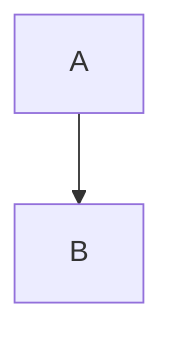
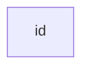
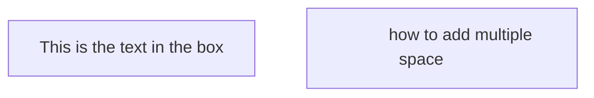

​
@[TOC]
## obsidian
下载 obsidian
obsidian apk下载办法_obsidian安卓版下载-CSDN博客
## mermaid
GitHub - mermaid-js/mermaid: Generation of diagrams like flowcharts or sequence diagrams from text in a similar manner as markdown
* 好的教程
Mermaid Cheat Sheet @ https://jojozhuang.github.io
* live eg
https://mermaid.live/
## 其它
- others
画图工具:亿图图
- 语法
NBSP：“Non-Breaking Space” &NBSP; 用于在 html， 也在 Mermaid 表示一个空格


## mermaid 使用
https://jojozhuang.github.io/tutorial/mermaid-cheat-sheet/
### flowchart
1.1 Graph
Possible directions are:

TB - top bottom
BT - bottom top
RL - right left
LR - left right
TD - same as TB

    A-->B;


1.2 Nodes & shapes
- node default  

- node with text
```
id2["&nbsp;&nbsp;&nbsp;&nbsp;&nbsp;&nbsp;&nbsp;&nbsp; how to add multiple space &nbsp;&nbsp;&nbsp;&nbsp;&nbsp;&nbsp;&nbsp;&nbsp;"]
```

- node with round edges 
 id1(This is the text in the box)
- node in circle form
 id1((This is the text in the box]H))
- node with rhombus form
 id1{this is the text in the box}
- node with asymmetric shape
 id1>This is the text in the box]


​


